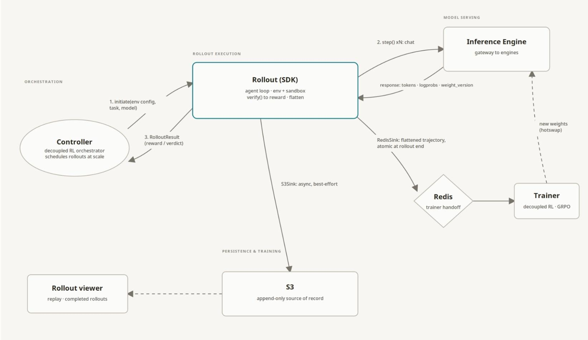

# Rollout-Engine SDK Design Doc

### Resources

- [Harbor Docs](https://www.harborframework.com/docs) \[1\]

- [env-zoo repo (created by Denis)](https://github.com/ppl-ai/envzoo/blob/main/SPEC.md#2-goals-and-non-goals) \[2\]

- [Decoupled RL Training Infra](https://app.notion.com/p/perplexity-ai/Decoupled-RL-Infrastructure-33b6172b229b80169cfdc88d02e74dea) \[3\]

- [Harbor Agent Trajectory Format](https://www.harborframework.com/docs/agents/trajectory-format) \[4\]

- [Harbor Custom Agents](https://www.harborframework.com/docs/agents#running-a-custom-agent) \[5\]

- [River Repo](https://github.com/ppl-ai/river) \[6\]

## Introduction

As Perplexity moves to post-training more models, we need centralized infrastructure to run rollouts both for training and for evals. To reduce research friction, such a system should:

- Work across both internal and external models

- Be cloud provider agnostic

- Provide a rich set of configurable env parameters

This design doc presents a low level design for *Rollout-Engine*, a SDK which runs a set of task rollouts satisfying all the above.

## Core Concepts

**Task** - consists of a single instruction, container environment, and test script that an agent is evaluated on.

**Sandbox** - isolated environment agent operates in to complete a given RL task.

**Message -** one item in the conversation that results from a model inference call: {role: user \| assistant \| tool \| system, text, token_ids?, logprobs?, weight_version?}

**Step -** a single action-observation exchange: the agent proposes an action (an assistant Message with tool calls), the environment executes it in the Sandbox, results come back as observations (tool Messages). A rollout is made of many steps.

**Trajectory -** ordered append only list of Message objects produced by a rollout. Record of agent actions + observations across steps

**Rollout -** one execution of a task on a sandbox: initiate → step loop → verify → teardown.

**Harness** - the logic implementing the inference + tool call loop an agent executes to solve a task. Includes logic needed to spawn subagents.

**Agent** - an instance of a running harness that’s executing tool calls and solving a user or parent agent task.

## Design Overview

### What the SDK Owns:

- Acquiring and releasing ONE sandbox on a user specified cloud provider

- Running the env or agent loop

- Calling a user specified model

- Recording exact prompts, generated tokens, tool calls, env changes, rewards, and other artifacts

- Enforcing rollout and tool call timing deadlines

- Exposing cancellation, progress, and heartbeat hooks.

### What the SDK does NOT Own:

- Trajectory rendering business logic (this should be a separate library)

- Inference weight synchronization during the training loop

- Controller coordination of allocation of compute resources (an external controller should be built on top of this library)

- Centralized task-store service or rollout viewing

- A universal verifier class hierarchy (this is a mess according to [Lequn Chen](mailto:lequn@perplexity.ai) and [Ziqing Hu](mailto:ziqing@perplexity.ai)

### Rollout Lifecycle:

- initiate(env_config, task, seed, stop_conditions) → Sandbox

  - Instantiates a RL sandbox environment for a rollout given a user environment config and task on a user specified cloud platform.

  - stop_conditions: object containing max_steps, max_content_tokens, max_tool_calls etc

- step(action) → StepResult

  - Runs one **Step**: caller passes the action (assistant **Message** with tool calls); the SDK executes those tool calls in the **Sandbox** and appends action + observation **Messages** to the **Trajectory**, tagged with the step index

  - Any training metadata on the action (token_ids, logprobs, weight_version) is recorded as-is and written to a Redis token logprobs buffer if in training

  - The step ends when the action’s tool calls have finished executing returning a StepResult object which carries the status (Running, Done, Failed) which tells the caller what’s next

- verify() → RolloutResult

  - Runs Tasks’s verification (test script or judge) against final **Sandbox** state + **Trajectory** state and produces RolloutResult which contains reward, verdict, per-step stats, failure info

### How Rollout SDK Integrates With Decoupled RL Training

## Package Layout

| **Package** | **Responsibility** |
|----|----|
| rollout.templates | Templates for the task, request, trajectory, reward, artifact, and model results classes |
| rollout.engine | Rollout lifecycle state machine, deadlines, retries, cancellation, and cleanup business logic |
| rollout.inference_router | Inference gateway router + handles model responses |
| rollout.sandbox | Provider/session/bundle protocols and capability model |
| rollout.trajectory | Append-only recorder, schema validation, serialization |
| rollout.verify | Verifier class handling business logic for running and recording env verifier results |
| rollout.sink | Handles writing and retries to the S3 trajectory store and the append-only Redis cache for trajectory log-probs. |

Note we expose all these components to the user, so they can build their own rollout loops. In this way, they can customize their error handling for instance if the RL environment set up doesn’t work properly for instance. However, we still provide end to end rollout support via rollout.engine if users want the entire logic of how rollouts run to be a blackbox.

## SDK Interfaces

### Task

A Task is a portable unit of work executed by one Rollout, packaging the agent’s objective, required sandbox env, and success criteria independently of model, trainer, or sandbox provider

- task_id: identifier referenced by every rollout of this Task

- instructions: objective presented to the agent as the initial user Message

- env: EnvironmentSpec describing the portable env required by the Task

- harness: HarnessSpec defining the agent harness to be used to complete the task

- verification: Verification spec identifying the verifier and the configuration used to evaluate the completed rollout

### Engine

The Engine controls lifecycle concurrency, phase deadlines, cancellation, and engine-owned retries.

#### EngineConfig

- max_concurrent_rollouts: int = 32

- max_concurrent_acquires: int = 8

- max_concurrent_scoring: int = 8

- heartbeat_interval_s: float = 10

- heartbeat_stale_s: float = 45

- production_mode: bool = true

- cleanup_always: true

- sandbox_acquire: TimeoutRetryConfig

- environment_prepare: TimeoutRetryConfig

- cleanup: TimeoutRetryConfig

### Sandbox

- SandboxConfig: user-facing configuration for selecting and provisioning a sandbox

  - provider: e2b \| modal \| space \| docker

  - resource specs: cpu, memory, operating system, gpu etc.

- HarnessSpec: user-facing configuration for how the agent should be run in the sandbox

  - harness: pointer to harness code that can then be set up in the environment

  - inference_token_budget

  - inference_cost_budget

  - max_tool_calls: number of max tool calls before the rollout auto fails

- EnviromentSpec: stored on the Task

  - image: container reference

  - working_dir: default dir for command execution

  - network_policy: network access and exposed ports

  - env variables/git history (for coding tasks)

- SandBoxProvidor(Protocol): defines the common provisioning interface implemented by provider specific classes such as E2BProvider, ModalProvidor, PplxSpaceProvidor, etc

  - create(Environment: EnvironmentSpec, Config: SandboxConfig, Harness: HarnessSpec) → Sandbox:

  - Translates portable environment requirements to provider's API request

  - Provisions environment

  - Returns provider independent Sandbox object

- Sandbox: object created and returned by SandboxProvidor

  - execute(command) → ExecResult: runs command and returns stdout, stderr, exit code

  - upload(source, destination): for file transfer

  - download(source) → bytes: for file transfer

  - teardown(): terminates sandbox and releases its resources

### Inference Routing

#### InferenceConfig

User facing config specifying the inference method, endpoints, and timeouts.

- provider: llmapi \| vllm \| rose

- model: model name or checkpoint path

- temperature

- max_tokens

- max_in_parallel (max inference calls to endpoint in parallel)

- inference_call: TimeoutRetryConfig

#### ModelClient(Protocol) 

Common interface implemented by provider-specific clients such as LlmApiClient, VllmClient, and RoseClient

- sample(messages: list\[Message\], tools: list\[ToolSchema\]) → Message:

- Accepts conversation history + available tools and sends one request to configured inference provider

- Converts response into assistant Message, preserving token metadata when available

- Returns Message to step(action)

### Sink

There are two processes the Sink primarily handles: during training it should write inference token logprobs to the Redis cache so the training loop can async update its weights later, and it should also persist all generated trajectories to a S3 bucket store where they can be read and analyzed by users later on.

Persisting rollouts to s3 is done on a best effort basis whereas writing logprobs to the Redis Cache is mandatory and should trigger a failure of the rollout if it does not succeed after retries.

#### SinkConfig

- Redis rollout logprobs cache endpoint (for decoupled RL training)

- S3 trajectory store endpoint (for where we stream outputted trajectories)

  - s3_format

  - compression mode

- redis_cache_write: TimeoutRetryConfig

- s3_bucket_write: TimeoutRetryConfig

## Harness Implementation

Ultimately, the rollout engine is going to need to be compatible with a large set of agent harnesses that span a variety of agent tasks that evaluators and researchers are working with. We prefer the plan where Harbor implements custom agents \[[5](https://www.harborframework.com/docs/agents#running-a-custom-agent)\] which would support both external agents (agents that live externally to the sandbox that users can implement to make tool calls in the environment), or internal agents which can be injected to then run an agent loop in the sandbox.

### Base Harness

[Reference Impl](https://github.com/harbor-framework/harbor/blob/main/src/harbor/agents/base.py)

BaseAgent:

- name

- version

- setup(environment)

  - setups the agent and its tools in the RL environment ie registering MCP servers

- run(instruction, environment, agent_context)

  - runs the agent in a given environment for one instance of the agent loop (inference + tool calls resulting from inference). populates context with results inference + tool calls afterwards.

###  External Harnesses

External agents would implement the same base agent parent class as specified above but would be responsible for handling inference by themselves along with contacting the environment on the chosen infrastructure platform once the agent tries to run tools.

### Internal Harness

Internal agents live on the sandbox where they can then directly interact with the environment without any networking logic. They use a different base class than base agent.

BaseInstalledAgent:

- async install()

  - Abstract async method that concrete agents implement to install their required executables and dependencies

- setup()

  - creates installation and logging directories, runs install() and wraps installation failures for best effort set up.

- version()

- exec(command / tool call)

  - Has variants of whether the agent is executing as root or as an agent

- render_instruction()

  - Applies the configured prompt template or returns the original instruction unchanged if no template exists

## SDK Outputs

Generated rollout results should be easily queryable and should be in a format that is easily processable by downstream actors that could be doing further grading or running queries on a set of rollouts pertaining to a given task. As such we need a rich Rollout return object data schema.

### RolloutResult

- rollout_id (primary key to query rollout IDs by)

- schema_version

- attempt

- run_id

- group_id

- task_id

- status: succeeded, failed, cancelled, timed_out

- started_at

- completed_at

- duration_ms

- error: ErrorType

- model_name

- model_endpoint

- sandbox_provider

- trajectory: TrajectoryObject

- reward

### TrajectoryObject

For the time being the outputted trajectory format will follow the one proposed by Harbor which you can read more about [here](https://www.harborframework.com/docs/agents/trajectory-format) \[4\]. We chose the Harbor format since it provides a rich set of statistics and fine grained distinction between different components of the trajectory. In the future we plan on implementing a more fine grained centralized library where trace rendering will be handled.

## Error Handling

#### TimeoutRetry Config

A struct defining how timeouts and retries for a given process in the SDK should be handled:

- timeout_value: in seconds

- retry_type: exponential backoff or fixed interval

- retry_interval: either a time interval for fixed interval, or an exponential factor for exponential backoff

- num_attempts: number of retry attempts

#### Errors Classes 

Errors returned should have fine grained types that clearly delineate where failures happened in the SDK stack. A parent error class should handle containing the error message along with stack trace, and then we propose more fine grained child error classes for each error type.

- RolloutError

  - Parent class

  - Error message

  - Stack trace

- TaskError

  - Invalid task or unsupported task configurations

- PolicyError

  - Malformed tool calls, invalid model responses, model refusals etc.

- EnvironmentError

  - Reset or step rejected by task environment

- SandboxError

  - Sandbox provisioning failures or provider disconnects

- InferenceError

  - Gateway unavailable or inference streaming disconnected/reset

- SinkError

  - Sink unavailable or partial commit happened

- Cancelled

  - Client based rollout aborts

## Implementation Milestones

### M1: Centralized task and configuration registry

- Build the API-first control plane for registering, validating, versioning, grouping, and querying Harbor-formatted tasks and environment configurations.

- Onboard the initial browser-agent dataset.

- Support CLI-based workflows.

### M2: Rollout persistence, search, and viewer

- Define the canonical RolloutResult and trajectory schemas.

- Persist rollout metadata and artifacts.

- Deliver a basic interface for inspecting trajectories, rewards, verifier results, warnings, and failures.

### M3: Provider-agnostic rollout engine

- Implement the SDK lifecycle (initiate, step, verify, teardown) and harness interfaces.

- Implement inference routing, deadlines, retries, and cancellation.

- Implement trajectory recording and an initial E2B sandbox provider.

### M4: End-to-end evals on common infrastructure

- Integrate the registry, rollout engine, and viewer with the shared eval or benchmark workflow.

- Port representative browser and coding evals.

- Support concurrent rollouts.

- Validate the sandbox provider abstraction with an additional provider when available.

### M5: RL training infrastructure integration

- Connect the rollout engine to the decoupled Lotus training stack, including self-hosted inference through the standard streaming API.

- Implement training metadata capture and mandatory Redis log-prob writes.

- Implement S3 trajectory persistence and weight-version propagation.
